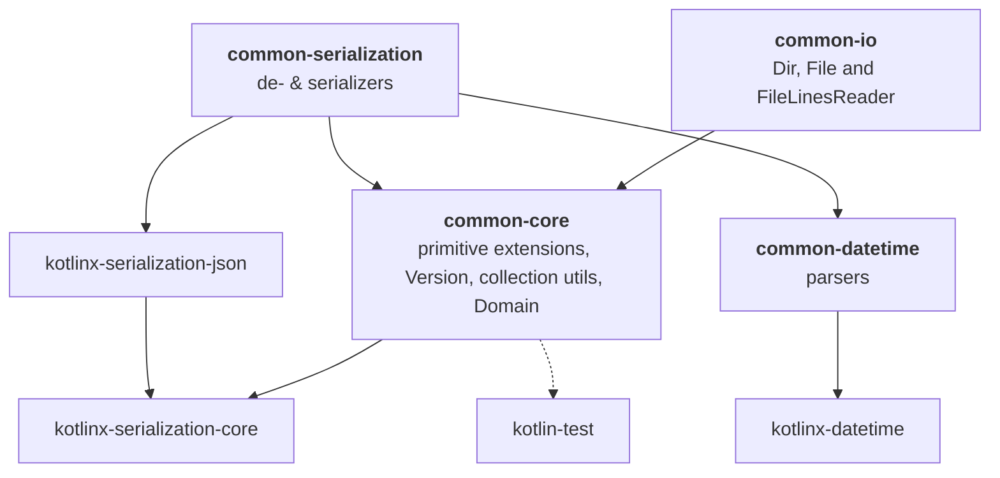

# Common utilities

These Kotlin/Common domain independent utilities use minimal dependencies.

## Project hierarchy

## Commands

- `gradlew dependencyUpdates --no-configuration-cache --no-parallel -Dorg.gradle.warning.mode=none` - Report updates
- `gradlew wrapper --gradle-version 9.5.1 --distribution-type all` - Update Gradle wrapper
- `gradlew spotlessApply --no-configuration-cache` - Format Kotlin source
